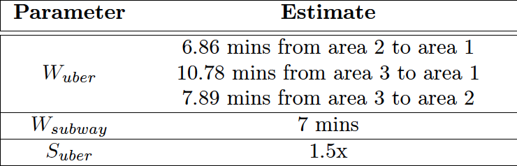

# Uber - Predictive Load Management

**Problem Statement** 

Ride-sharing companies such as Uber and Lyft have historically had issues with large-scale events (inlduing concerts and sports events) to the extent that customers are forced to either accept high wait times or exorbitant surge priing. The below analysis attempts to suggest a solution to that problem, by predicting requests ahead of time, which would allow a company to pre-emptively relocate vehicles in anticipation of demand spikes. 

The project was part of IEOR 4418 - Transportation Analytics and Logistics at Columbia.

**Data Sources**

In order to correctly test the effectiveness of our approach, we select a set of control dates and a single effect date. Since the available [Uber data](https://github.com/fivethirtyeight/uber-tlc-foil-response) was from 2014, we picked Tuesday May 13th, 2014 to be the effect day: that night Lady Gaga performed at a sold-out Madison Square Garden. In order to eliminate any potential distortion due to day of week, we picked the remaining Tuesdays in May 2014 to be in the control group, making sure that no extr-ordinary events took place during those days. Given the limited data available from Uber, we used [NYC Yellow Cab data](http://www.nyc.gov/html/tlc/html/about/trip_record_data.shtml) as a substitue to estimate several of our model parameters

**Methodology**

- Step 1: manually create geolocation hashes using [geohash](http://geohash.gofreerange.com/), a tool that has a corresponding [Python API](https://pypi.org/project/pygeohash/) to easily turn the hashes into lat / lon pairs. Using these gehashes, we created three concentric zones surrounding Madison Square Garden, with area 1 being the area immediately surrunding MSG.

&nbsp;&nbsp;&nbsp;&nbsp;&nbsp;&nbsp;&nbsp;For the purposes of our modeling, we assumed area 3 to be all locations within a 15-minute driving radius of area 2. &nbsp;&nbsp;&nbsp;&nbsp;&nbsp;&nbsp;&nbsp;We never assume a customer in area 1 to be paired with a driver in area 3, but still included it in order to model the &nbsp;&nbsp;&nbsp;&nbsp;&nbsp;&nbsp;&nbsp;process with an infinite queue model (i.e. all customers will be served)

- Step 2: Define problem: We decided to approach the problem from two different perspectives: a linear program and simluation. The linear program(s) were primarily used to find the optimal relocation of vehicles between the three areas, given the provided Uber trip data. We then used simulation to understand how robust our estimations were: given a Poisson process of customer arrivals, how much would profit increase as a function of demand, and what are break-even levels

- Step 3: Estimate parameters: due to the sparse data available from Uber, we relied on estimation techniques to obtain most of our model parameters
    - N0j: Actual (observed) supply of Ubers in area j, obtained from [Uber data](https://github.com/fivethirtyeight/uber-tlc-foil-response) during the control days. 

      

       
    
    -  Dj: True (unbiased) demand for Ubers in area j. We reasoned that there is a true (unobservable) demand for Ubers which, if adjusted for customer who opt for alterntaive transportation methods because of surge pricing or long wait times, leads to the observed demand during the effect date. For this purpose, our assumptions are D1 = 100 and D2 = 20.
    
    - xij: Probability that a customer in location i will choose Uber, given that driver needs to travel from location j. In order to model these probabilities, we applied a multi-nomial logit choice model, for we first defined utility functions for Ubers and subways, which we assumed were the only two options. Fro simplicity, we assumed that only two factors affect people's utility function: wait time (W) and price (P), which was represented as a sensitivity to surge pricing (S) in the case of Ubers. S was estimated using average surge pricing factors during the Billy Jole concert at MSG in April 2018. Uber travel times were estimated using average Yellow Cab trip duration between the different areas for all trip where duration ≤ 15 minutes. 
    
      

       

  &nbsp;&nbsp;&nbsp;&nbsp;&nbsp;&nbsp;&nbsp;&nbsp;We finally applied the resulting utilities to a standard softmax function to obtain probabilities

    - cij: Cost of moving a vehicle from area i to area j. The cost was calculated as follows:
    
      

       
    
&nbsp;&nbsp;&nbsp;&nbsp;&nbsp;&nbsp;&nbsp;&nbsp;&nbsp;&nbsp;&nbsp;&nbsp;&nbsp;&nbsp;where M3 is a factor to scale the cost of moving cars into the system from area 3.

cij

|   |    1    |    2    |    3    |
| - | ------- | ------- | ------- |
| 1 | 0       | 4.14604 | 8.19311 |
| 2 | 4.14604 | 0       | 5.24474 |
| 3 | 8.19311 | 5.24474 | 0       | 

r = 13.54
